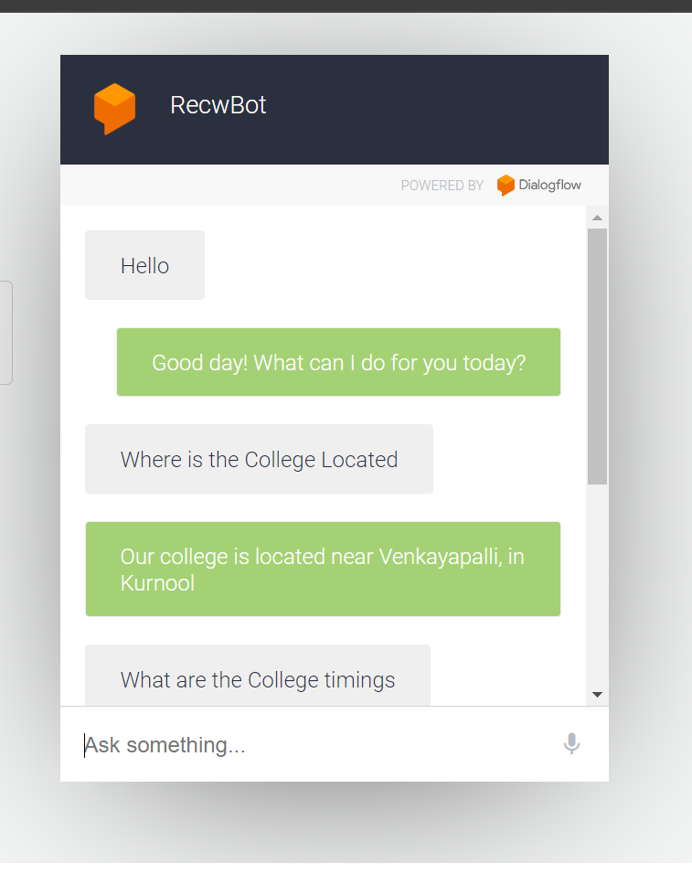
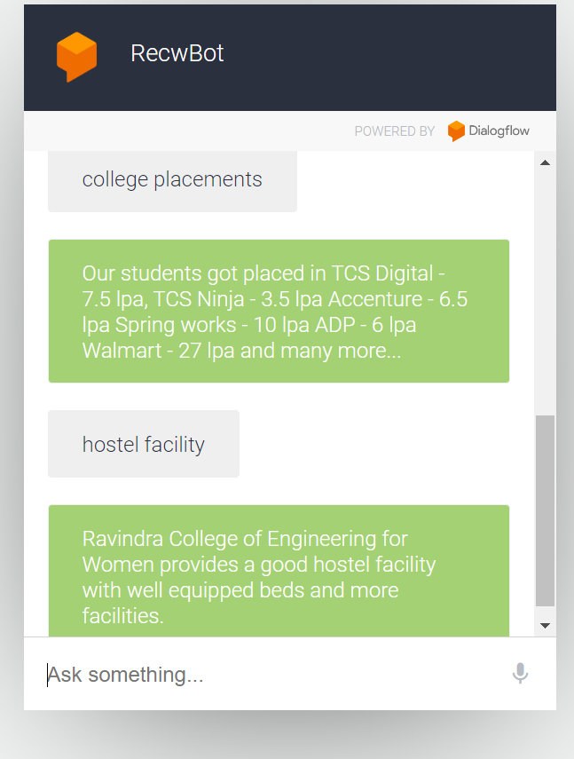

**College Chatbot Using Google Dialogflow**

This repository contains a chatbot built using Google Dialogflow, designed to answer queries related to our college. The chatbot provides information such as fee structure, hostel details, course offerings, Placement opportunities, and more.

**Project Overview**
The College Chatbot uses natural language processing (NLP) capabilities provided by Google Dialogflow to understand and respond to user queries in a conversational manner. It is designed to help students, parents, and prospective applicants get answers to common questions about the college quickly and efficiently.

**Features:**
1.Automated Responses: Provides instant responses to queries regarding the college.
2.Multiple Intents: Handles various queries such as admission details, course information, contact information, etc.
3.Contextual Awareness: Understands and remembers the context of conversations to provide more relevant responses.

**Sample Conversation flow**

